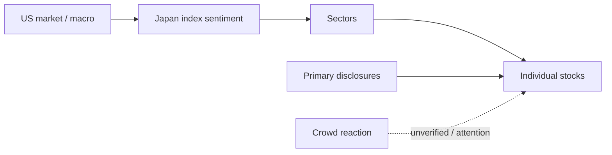

# Report Template

Use this template for `standard` and `deep` outputs. Keep unavailable fields explicit rather than inventing facts. Optimize for low cognitive load: lead with tables, use one small Mermaid diagram when relationships are complex, and keep prose short.

````markdown
# Stock Market News Digest
Period: {{date_range}}
Market scope: Japan equities primary / US market context secondary
Generated: {{timestamp_jst}}

## 1. Today's Conclusion
| Takeaway | Why it matters for Japan equities | Evidence layer | Confidence / caveat |
| --- | --- | --- | --- |
| {{takeaway_1}} | {{market_implication_1}} | primary / media / crowd | {{confidence_or_caveat_1}} |
| {{takeaway_2}} | {{market_implication_2}} | primary / media / crowd | {{confidence_or_caveat_2}} |
| {{takeaway_3}} | {{market_implication_3}} | primary / media / crowd | {{confidence_or_caveat_3}} |

## 2. Market Map
Use this only when it reduces cognitive load. Keep it to 5-9 nodes.



## 3. Japan Market Snapshot
| Asset / Index | Move | Driver or interpretation | Japan equity implication | Source |
| --- | --- | --- | --- | --- |
| Nikkei 225 | {{nikkei_move}} | {{nikkei_driver}} | {{nikkei_implication}} | {{source}} |
| TOPIX | {{topix_move}} | {{topix_driver}} | {{topix_implication}} | {{source}} |
| Growth Market | {{growth_move}} | {{growth_driver}} | {{growth_implication}} | {{source}} |
| FX | {{fx_move}} | {{fx_driver}} | {{fx_implication}} | {{source}} |
| Rates | {{rates_move}} | {{rates_driver}} | {{rates_implication}} | {{source}} |
| Sectors | {{sector_moves}} | {{sector_driver}} | {{sector_implication}} | {{source}} |

## 4. Notable Individual Stocks
| Ticker | Company | Catalyst | Price / volume reaction | Evidence layer | Caveat | Importance |
| --- | --- | --- | --- | --- | --- | --- |
| {{ticker}} | {{company_name}} | {{catalyst}} | {{reaction}} | primary / media / crowd | {{caveat}} | {{score_or_rank}} |

Details only when needed:
- {{ticker}} {{company_name}}: {{short_nuance_not_captured_in_table}}

## 5. Trending Themes
| Theme | Related stocks | Primary facts | Media interpretation | Crowd reaction | Durability / overheating risk |
| --- | --- | --- | --- | --- | --- |
| {{theme_name}} | {{related_stocks}} | {{primary_facts}} | {{media_arguments}} | {{social_arguments}} | {{durability_and_risk}} |

## 6. US Market, S&P 500, and Major US Equities
| Item | Move / fact | Why it matters to Japan | Related Japan themes or stocks | Source |
| --- | --- | --- | --- | --- |
| S&P 500 | {{sp500}} | {{sp500_implication}} | {{related_japan}} | {{source}} |
| Nasdaq | {{nasdaq}} | {{nasdaq_implication}} | {{related_japan}} | {{source}} |
| Dow | {{dow}} | {{dow_implication}} | {{related_japan}} | {{source}} |
| US 10-year yield | {{us10y}} | {{yield_implication}} | {{related_japan}} | {{source}} |
| USD/JPY | {{usdjpy}} | {{fx_implication}} | {{related_japan}} | {{source}} |
| NVDA / AMD / AVGO / AAPL / MSFT / TSLA | {{mega_cap_summary}} | {{mega_cap_implication}} | {{related_japan}} | {{source}} |

## 7. Crowd Trends
| Stock / theme | Topic volume | Representative reaction | Sentiment skew | Rumor / unverified flag |
| --- | --- | --- | --- | --- |
| {{stock_or_theme}} | {{topic_volume}} | {{representative_summary}} | optimistic / mixed / pessimistic | yes / no: {{flag_detail}} |

Treat this section as market participant reaction, not factual confirmation.

## 8. Watch Items and Unverified Information
| Claim or item | Where it appeared | Primary-source status | How to treat it |
| --- | --- | --- | --- |
| {{claim}} | {{source_or_platform}} | confirmed / not found / pending | {{treatment}} |

## 9. Sources
| Source type | Sources checked | Notes |
| --- | --- | --- |
| Primary | TDnet / JPX / Company IR | {{primary_notes}} |
| Global market news | Reuters / Bloomberg / AP / exchange or index pages | {{global_notes}} |
| Japan equity media | Kabutan / Minkabu / Kabushiki Shimbun / Traders Web | {{japan_media_notes}} |
| Crowd | X/Twitter existing skill / popular-news rankings | {{crowd_notes}} |
````

## Output Rules

- Write in the user's requested language; default to Japanese when the user is Japanese.
- Keep source links near the claims they support when possible.
- Mark X/Twitter-derived claims as `market participant reaction`.
- Mark rumors and unsourced explanations as `unverified`.
- Say `not found in checked primary sources` when a material claim is not confirmed after checking TDnet, JPX, or company IR.
- Avoid "the stock rose/fell because..." unless the causal link is explicitly supported; prefer "media attributed the move to..." or "participants discussed...".
- Use tables for the main report body unless the user explicitly asks for a prose memo.
- Use no more than one Mermaid diagram in `standard` output. For `deep`, use at most two diagrams, and only if each diagram adds clarity.
- Keep Mermaid labels short and quote labels that contain punctuation or spaces.
- Do not make table cells so long that the table becomes unreadable; move detailed nuance below the table.
